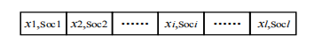

# Train Speed Profile Optimization Based on GA and PSO

[](https://opensource.org/licenses/MIT)
[](https://www.mathworks.com/products/matlab.html)

This repository provides a MATLAB implementation for optimizing train speed profiles to achieve energy-efficient operation. The project leverages Genetic Algorithm (GA), Particle Swarm Optimization (PSO), and two novel hybrid GA-PSO algorithms to find the optimal sequence of control actions (traction, cruising, coasting, and braking).

A key innovation of this project is a heuristic-based dimensionality reduction and encoding strategy. This method intelligently constrains the solution space by analyzing the track gradient, significantly improving the convergence speed and the quality of the final solution.

## Features

- **Four Optimization Algorithms:** Implements standard GA, standard PSO, and two hybrid variants (GA-PSO and PSO-GA) for comprehensive analysis.
- **Novel Heuristic Encoding:** A sophisticated encoding strategy that reduces the problem's dimensionality by dividing the track into logical sub-intervals based on slope characteristics. This ensures a higher proportion of feasible solutions.
- **Detailed Train Dynamics Model:** The `TrainEnvironment` module simulates realistic train movement, considering factors like speed limits, tractive/braking effort curves, running resistance, and gradient effects.
- **Modular and Clear Structure:** The code is organized into distinct modules for algorithms, environment simulation, encoding/decoding, and parameter inputs, making it easy to understand and extend.
- **Visualization of Results:** Automatically generates plots for the optimized speed profile, control regimes, and energy consumption metrics.

## Core Concept: Heuristic-Based Dimensionality Reduction and Encoding

The primary challenge in train speed profile optimization is the vast and continuous search space. To address this, we developed a novel encoding method that reduces dimensionality and embeds expert knowledge into the optimization process.

### 1. Slope Classification

The algorithm first classifies the track profile. The total running resistance of the train, $F_R$, is a function of its position $x$ and velocity $v$:

$F_R = F_s(x) + F_0(v)$

where $F_s(x)$ is the additional resistance from the track gradient and $F_0(v)$ is the basic running resistance. Based on this, track segments are classified as follows:

-   **Steep Downhill:** A segment where the train accelerates even when coasting (i.e., the net force $-F_R > 0$).
-   **Steep Uphill:** A segment where the train decelerates even under maximum traction force $F_T$ (i.e., the net force $F_T - F_R < 0$).
-   **Mild Slope:** All other segments that are not Steep Uphill or Steep Downhill.

### 2. Sub-interval Division

Based on the slope classification, the entire track is divided into a series of logical sub-intervals. The division rule is:

-   A sub-interval begins at the start of a **Steep Uphill** or **Mild Slope**.
-   It ends at the termination point of the first **Steep Downhill** encountered after its start.
-   **Edge cases** are handled by adding zero-length dummy segments to ensure the logic is consistent at the route's start and end points.

This division transforms a complex track profile into a structured sequence of manageable optimization problems.

### 3. Predefined Operating Sequence

Within each sub-interval, we enforce a logical sequence of operating conditions to further constrain the search and eliminate infeasible solutions:

`{Maximum Traction -> Cruising -> Coasting -> (Necessary) Braking}`

The optimization algorithm's task is not to decide the *sequence* but to find the optimal *locations* for switching between these states.

-   The switch to **Cruising** from Maximum Traction at position $x_1$ must occur after the sub-interval start ($x_{a0}$) and before the start of the Steep Downhill segment ($x_{a1}$), i.e., $x_1 \in (x_{a0}, x_{a1}]$.
-   The switch to **Coasting** from Cruising at position $x_2$ must occur after the switch to Cruising ($x_1$) and before the end of the sub-interval ($x_{a2}$), i.e., $x_2 \in (x_1, x_{a2}]$.
-   Braking is applied automatically by the decoder when needed to respect speed limits or stop at the target station.

### 4. Encoding Method

We use **real-number encoding**. Each chromosome represents a complete operating strategy for the entire journey.

-   **Gene:** A gene is a floating-point number representing the *position* ($x_i$) of a switch point between operating conditions (e.g., the position where the train switches from traction to cruising).
-   **Chromosome:** A chromosome is an ordered array of all such switch point positions.



Since the number of sub-intervals and the number of switch points within each sub-interval are fixed by our heuristic rules, the chromosome length ($l$) is constant. This fixed-length, real-encoded structure is ideal for both GA and PSO.

## Project Structure
.
├── Decoder/
│ └── TractionSolve.m # Decodes a chromosome into a full train trajectory
├── Dimensionality_Reduction/
│ └── ... # Core functions for slope analysis and sub-interval division
├── Encoder/
│ └── ... # Functions for fitness evaluation and population sorting
├── GA/
│ └── ... # Core Genetic Algorithm operators (selection, crossover, mutation)
├── OptimizationOutputs/
│ └── ... # Default directory for saving plots and results
├── PSO/
│ └── ... # Core Particle Swarm Optimization operators
├── TrainEnvironment/
│ └── ... # Train dynamics model, ATP protection, resistance calculations
├── ProjectInput_LineParameters.m # Input file for track data (gradients, speed limits, etc.)
├── Run_GA.m # Main script to run the GA-based optimization
├── Run_PSO.m # Main script to run the PSO-based optimization
├── Run_GAPSO.m # Main script for GA (exploration) + PSO (exploitation) hybrid
└── Run_PSOGA.m # Main script for PSO (exploration) + GA (exploitation) hybrid

## Getting Started

### Prerequisites

-   MATLAB (tested on R2020a or newer)

### How to Run

1.  **Clone the repository:**
    ```bash
    git clone https://github.com/your-username/Train_Speed_Profile_Optimization_Based_on_GA-PSO.git
    cd Train_Speed_Profile_Optimization_Based_on_GA-PSO
    ```
2.  **Configure Parameters:**
    Open `ProjectInput_LineParameters.m` in MATLAB to set the line parameters, such as track length, gradients, speed limits, and station locations.

3.  **Run an Optimization:**
    Execute one of the main scripts in the MATLAB command window or editor:

    -   To run the **Genetic Algorithm**:
        ```matlab
        Run_GA
        ```
    -   To run the **Particle Swarm Optimization**:
        ```matlab
        Run_PSO
        ```
    -   To run the **GA-PSO Hybrid Algorithm**:
        ```matlab
        Run_GAPSO
        ```
    -   To run the **PSO-GA Hybrid Algorithm**:
        ```matlab
        Run_PSOGA
        ```
4.  **View Results:**
    Upon completion, the script will generate and save plots of the optimized speed profile, control regimes, and performance metrics in the `OptimizationOutputs` folder.

## Algorithms Implemented

This project provides four distinct optimization algorithms:

1.  **`Run_GA` (Genetic Algorithm):** A classic evolutionary algorithm that uses selection, crossover, and mutation to evolve a population of solutions.
2.  **`Run_PSO` (Particle Swarm Optimization):** A swarm intelligence algorithm where particles move through the solution space based on their own best-known position and the entire swarm's best-known position.
3.  **`Run_GAPSO` (GA-PSO Hybrid):** A hybrid method where GA is used for global search (**exploration**) to identify promising regions of the solution space. The best individuals from the GA are then used to initialize a PSO swarm, which performs a refined local search (**exploitation**).
4.  **`Run_PSOGA` (PSO-GA Hybrid):** An alternative hybrid method where PSO is used for initial global exploration. Genetic operators (crossover and mutation) are then applied to the swarm to enhance diversity and escape local optima, giving GA the role of exploitation and diversity maintenance.

## Contributing

Contributions are welcome! If you have suggestions for improvements or want to add new features (e.g., different optimization algorithms, more complex train models), please feel free to fork the repository and submit a pull request.

## License

This project is licensed under the MIT License - see the [LICENSE](LICENSE.md) file for details.

## Citation
If you use this code in your research, please consider citing this repository:
@software{YourName_2023_TrainSpeedProfile,
author = {Your Name},
title = {{Train_Speed_Profile_Opimization_Based_on_GA-PSO}},
year = {2023},
publisher = {GitHub},
journal = {GitHub repository},
howpublished = {\url{https://github.com/your-username/Train_Speed_Profile_Optimization_Based_on_GA-PSO}},
}

1.项目的使用介绍
1.1 主文件是Run_GA, Run_PSO, Run_GAPSO, Run_PSOGA这几个文件，直接在matlab环境下运行这即可运行。下划线后的内容代表了调用了不同的算法，GA表示使用遗传算法进行优化，PSO表示使用粒子群优化算法继续优化，GAPSO表示使用遗传算法和粒子群优化算法混合优化，其中GA负责exploration而PSO负责exploitation，PSOGA表示使用粒子群优化算法和遗传算法混合优化，其中反过来PSO负责exploration而GA负责exploitation。
1.2 Decoder文件夹下的TractionSolve是启发式算法的decoder函数,负责将启发式算法通过encoding然后优化之后的结果decode为位置、速度、控制力、时间、能耗、工况的序列
1.3 TrainEnviroment是环境函数，包括限速、列车最大牵引力、最大控制力、列车基本运行阻力、减速度制动、线路附加阻力的计算函数以及最大能力曲线函数、ATP防护处理函数以及电分相处理函数以及列车状态迭代函数
1.4 Encoder文件夹下并不是纯粹意义上的encoder函数，而是针对人为的编码逻辑同样使用TractionSolve进行解算然后结算完成之后进行适应度计算和多个体根据适应度进行排序，所以换句话说TractionSolve既是encoder又是decoder
1.5 GA是遗传算法核心操作函数，包括初始化种群、选择、交叉和变异
1.6 PSO是粒子群优化核心操作函数，包括初始化种群、初始化速度、更新粒子位置和速度
1.7 PorjectInput_LineParameters是线路参数文件，包括线路曲线、线路限速、线路坡度和车站位置
1.8 OptimizationOutputs是仿真输出结果文件，输出位置、速度、控制力、时间、能耗、工况的序列的plot曲线
1.9 Dimensionality_Reduction是算法核心文件，主要目的为降低解空间的维度，并且增强启发式算法在处理列车速度曲线优化问题时的输出的可行性。包括线路坡道划分函数、线路子区间划分函数和初始工况设置以及

2. 项目降低解空间的维度思想介绍（也即编码思路介绍）
2.1 坡度判断
列车运行时,不同位置所处的线路断面不同。在采用遗传算法求解列车最优操纵序列时,如果在整个运行区间内随机生成列车工况转换点会产生大量的不可行解,甚至最后可能求不到可行解。比如,当列车在坡度很大的上坡道上运行时,如果采用惰行或者制动工况,则列车速度会急剧下降,可能会导致中间停车等。为使遗传算法能够产生较好的初始解,提高算法求解效率,本文将列车运行区间按坡道大小划分成不同的子区间,划分原则如下。假设列车以平均速度v运行,列车运行阻力FR满足式(3-1)所示关系。
F_R=F_s(x)+F_0(v)
当列车采用惰行工况时,若-FR>0,列车加速运行,则称列车当前所在坡道为大下坡道;
当列车采用最大能力牵引时,若F_T-FR<0,列车减速运行,则称列车当前所在坡道为大上坡道;
除大下坡道和大上坡道之外的坡道称为连续坡道。

2.2 子区间划分
根据上述规则将列车运行区间划分为若干子区间,一个子区间以大上坡道或连续坡道为起点,中间可能会经过若干个连续坡道或大上坡道,直到遇到大下坡道,并以大下坡道的末端为终点。其中,若列车起车点处为大下坡道,则在列车起车点处人为添加一段长度为0的连续坡道,与起车点处的大下坡道共同构成一个子区间;若列车停车点处为大上坡道或连续坡道,则在列车停车点处人为添加一段长度为0的大下坡道,与停车点处的大上坡道或连续坡道共同构成一个子区间。

2.3 初始工况设置
列车在一个子区间内的操纵工况设置为{全力牵引,恒速,惰行及必要的制动}。在子区间起点x_a0处设置全力牵引工况转换点;恒速工况转换点在前一个全力牵引工况转换点到该子区间内大下坡起始点范围内产生,即x∈(x_a0,x_a1],;假设恒速工况转换点在图中x_1处,则惰行工况转换点在前一个恒速工况转换点到该子区间终点范围内产生,即$x∈(x_1,x_a2]$,如2所示;当遇到低限速或需要制动减速时插入全力制动工况。

2.4 编码方法
本项目研究的问题是列车节能优化,求解列车在给定运行区间和运行时间条件下的最优操纵序列。这些操纵序列由一系列的工况转换点(x_i,S_oci)组成,其中x_i为工况转换点的位置,S_oci为对应位置的工况。因此,可以将每一个工况转换点作为基因,整个操纵序列W作为一个染色体。染色体为按照工况转换点位置排列的有序序列。由于工况转换点的位置x_i是连续变化的实数,工况为离散的几种,故本文采用实数编码方式进行编码。按照坡道划分方法将列车运行区间划分为多个子区间,并根据初始工况设置原则,随机产生工况转换的位置x_i,生成染色体。染色体构成如下图所示,其中l为染色体长度。由于列车运行区间固定,每个子区间内工况转换点数量固定,故染色体长度固定,即l为定值。


